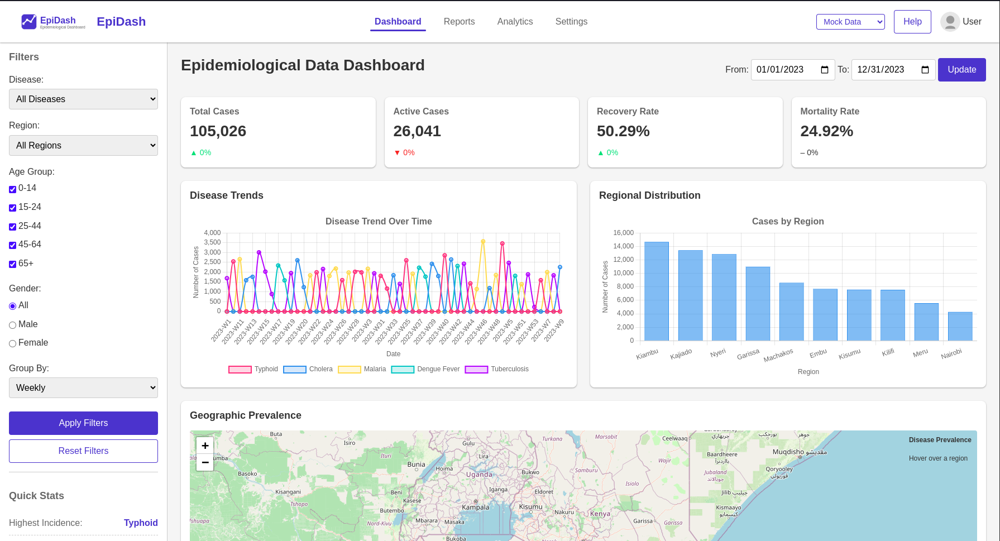

# EpiDash - Epidemiological Data Dashboard

A comprehensive web dashboard for visualizing and analyzing epidemiological data, specially designed as a showcase project for the CEMA Software Engineering Internship application.



## Overview

EpiDash is an interactive dashboard that visualizes epidemiological data across different regions, diseases, and time periods. It's built with modern web technologies and follows best practices for data visualization and user interface design.

## Features

- **Interactive Data Visualization**: Charts, maps, and tables to visualize disease trends
- **Advanced Filtering**: Filter data by disease, region, date range, age group, and gender
- **Dual Data Source Support**: Switch between mock data and real database data
- **Responsive Design**: Fully functional on desktop and mobile devices
- **Real-time Metrics**: Key statistics and indicators for quick data analysis
- **Data Export**: Export filtered data as CSV for further analysis
- **Geographic Visualization**: Map-based visualization of disease prevalence

## Technologies Used

- **Frontend**:
  - HTML5, CSS3, JavaScript
  - Chart.js for data visualization
  - Leaflet.js for map visualization
  
- **Backend**:
  - PHP for server-side processing
  - MySQL-compatible database structure (with mock data generation for demonstration)

## Installation & Setup

### Prerequisites

- Web server with PHP 7.4+ support
- MySQL database (optional - mock data is provided)

### Installation Steps

1. Clone the repository:
   ```
   git clone https://github.com/dlangkip/epidash.git
   ```

2. Upload files to your web server or place them in your local development environment's web root.

3. Configure the data source in `api/config.php`:
   ```php
   // Choose your preferred default data source: 'mock', 'database', or 'both'
   define('DEFAULT_DATA_SOURCE', 'mock');
   // Enable or disable the ability to switch between data sources
   define('ALLOW_SOURCE_SWITCHING', true);
   ```

4. If using the database:
   - Create a MySQL database
   - Import the `database/epidash.sql` file
   - Update the database credentials in `api/config.php`

5. Access the dashboard through your web browser:
   ```
   http://localhost/epidash/
   ```

## Project Structure

```
epidemic-dashboard/
  ├── api/               # Backend API endpoints
  │   ├── config.php     # Configuration settings
  │   ├── connection.php # Database connection
  │   ├── get_data.php   # Data retrieval endpoint
  │   └── process_data.php # Data processing functions
  ├── assets/            # Frontend assets
  │   ├── css/           # Stylesheets
  │   ├── js/            # JavaScript files
  │   └── img/           # Images and icons
  ├── data/              # Data files
  │   ├── disease_data.php # Sample disease data generator
  │   └── regions.php    # Region data for visualization
  ├── includes/          # PHP includes
  │   ├── header.php     # Header template
  │   ├── footer.php     # Footer template
  │   └── sidebar.php    # Dashboard sidebar
  ├── index.php          # Main dashboard page
  └── README.md          # Project documentation
```

## Usage

1. **Dashboard Navigation**: Use the top navigation menu to switch between different dashboard views.

2. **Data Source Selection**: Use the dropdown in the header to switch between:
   - Mock Data: Generated sample data for demonstration
   - Database: Real data from the MySQL database
   - Both Sources: Combined data from both sources

3. **Data Filtering**: Use the sidebar filters to narrow down data by:
   - Disease type
   - Region
   - Age group
   - Gender
   - Date range

4. **Data Visualization**: Interact with charts by hovering or clicking on data points for more details.

5. **Map Interaction**: Click on regions in the map to zoom in and view detailed statistics.

6. **Data Export**: Click the "Export CSV" button to download filtered data for external analysis.

## Customization

This dashboard is designed to be easily customizable:

- Modify `api/config.php` to adjust application settings
- Edit `data/regions.php` to update region information
- Customize the UI by modifying CSS files in `assets/css/`
- Add or modify visualizations in `assets/js/charts.js`

## Portfolio Demonstration

This project was created as a showcase for CEMA Software Engineering Internship application, demonstrating skills in:

- Frontend development (HTML, CSS, JavaScript)
- Data visualization 
- Backend API development (PHP)
- Responsive UI/UX design
- Geographic data visualization
- Statistical data processing

## About CEMA

The Center for Epidemiological Modelling and Analysis (CEMA) at the University of Nairobi is a multidisciplinary research hub focused on leveraging data-driven approaches to control infectious diseases and enhance public health outcomes across Kenya and Africa.

## License

This project is created for demonstration purposes. All rights reserved.

---

Created by [Kiprotich](https://dlang.benfex.net) - CEMA Internship Application 2025
